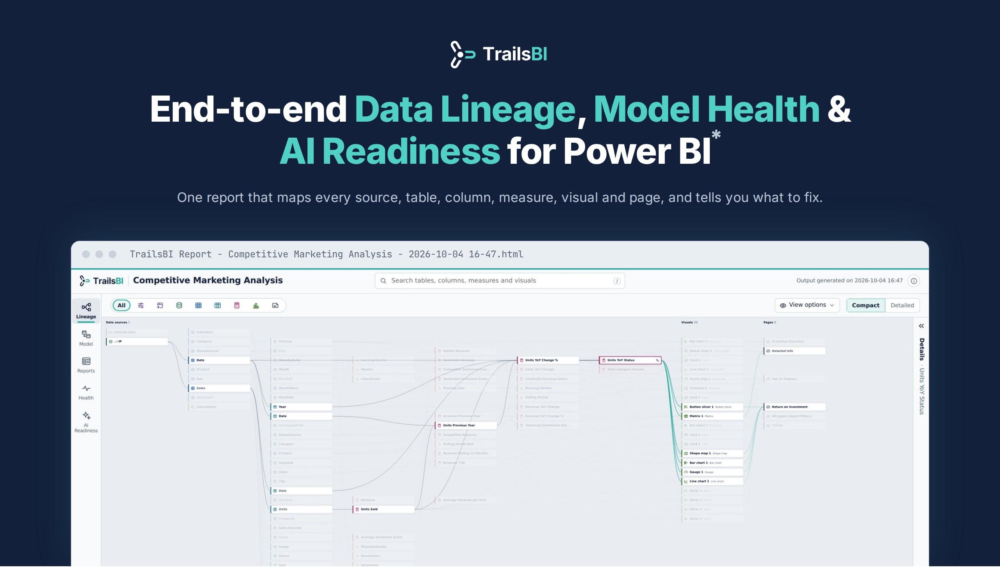
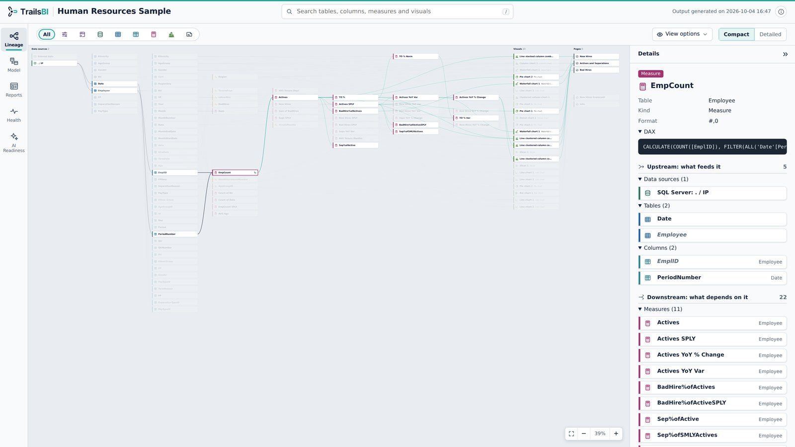
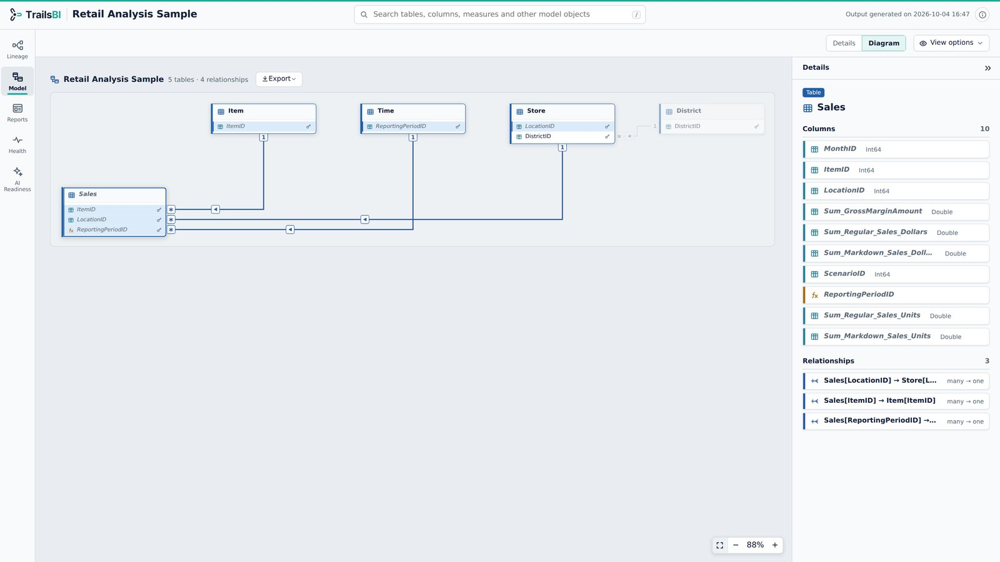
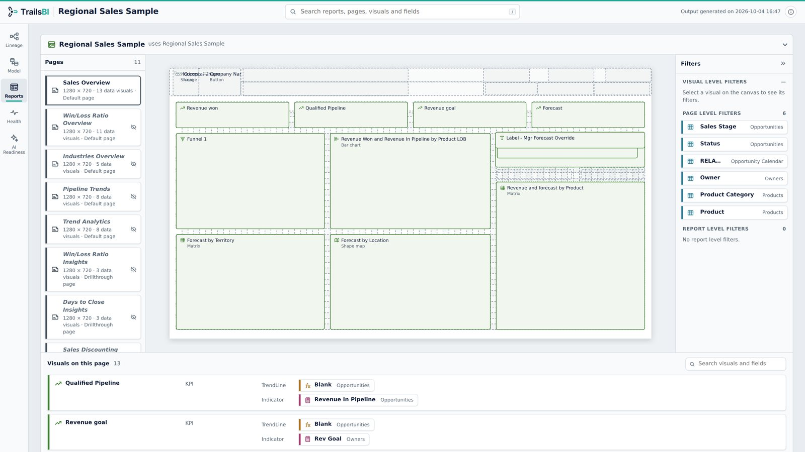
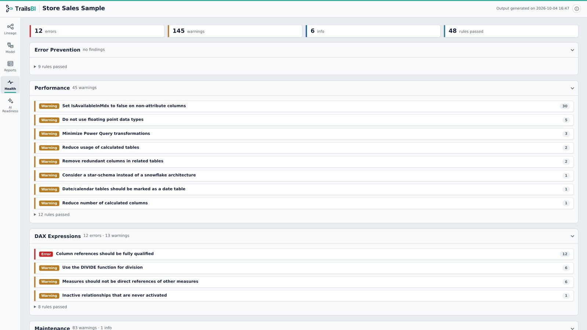
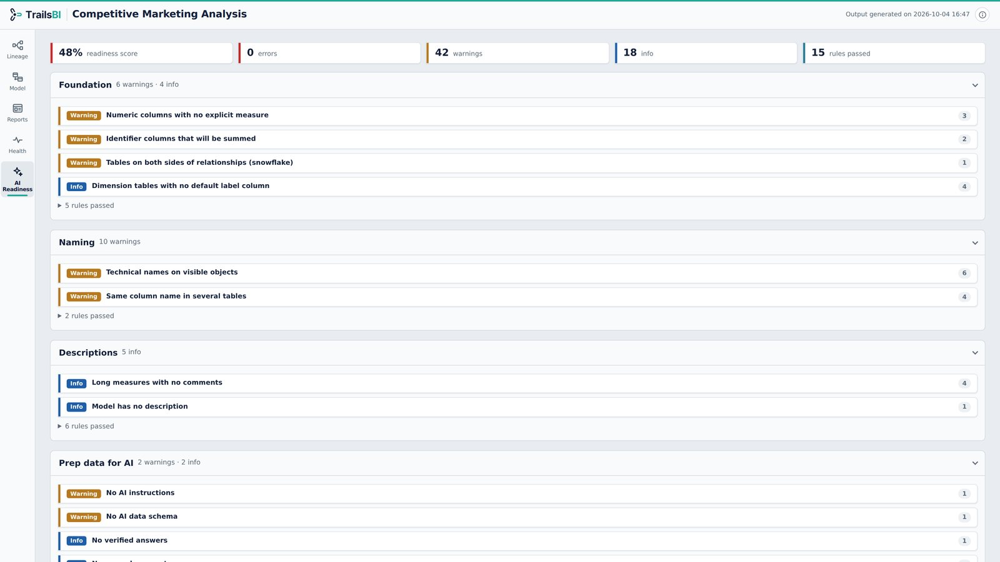

<p align="center">
  <a href="https://trailsbi.com"></a>
</p>

<p align="center">
  <a href="https://trailsbi.com"><b>Website</b></a>
  &nbsp;·&nbsp; <a href="#get-started"><b>Get started</b></a>
  &nbsp;·&nbsp; <a href="https://trailsbi.com/samples"><b>Sample Reports</b></a>
  &nbsp;·&nbsp; <a href="https://youtube.com/@trailsbi"><b>YouTube</b></a>
</p>

<p align="center"><sub>* Power BI is a trademark of Microsoft. TrailsBI is not affiliated with or endorsed by Microsoft.</sub></p>

## Trails for Power BI

TrailsBI reads a Power BI project saved as PBIP (TMDL and PBIR files) and builds one
self-contained HTML page you can open in any browser. It runs entirely on your machine:
no sign-in, no upload, no telemetry.

## Everything about your Reports and Semantic Models

### Lineage - Follow any field from source to visual

- Pick a column or measure and see every data source, table and measure it depends on, in navy.
- Everything built on it, down to the visuals and pages, lights up in teal.
- Compact cards for the whole picture, detailed cards with usage counts when you need them.



<table>
<tr>
<td width="50%" valign="top">
<h3>Model - Every table, column, measure and relationship</h3>

</td>
<td width="50%" valign="top">
<h3>Reports - What each page and visual actually uses</h3>

</td>
</tr>
<tr>
<td width="50%" valign="top">
<h3>Health - Best Practice Analyzer, without the setup</h3>

</td>
<td width="50%" valign="top">
<h3>AI Readiness - How well Copilot will understand the model</h3>

</td>
</tr>
</table>

## Get started

1. In Power BI Desktop, save your report as a Power BI project: **File > Save as > Power BI
   project (.pbip)**.
2. Install TrailsBI (Python 3.9 or later, no other dependencies):

   ```
   pip install trailsbi
   ```

3. Run it on your project:

   ```
   trailsbi "D:\Reports\Sales\Sales.pbip"
   ```

   This writes `TrailsBI Report - Sales - 2026-10-04 16-47.html` (with the current date and time)
   to the current folder. Open it in any browser.

Options:

```
trailsbi [PROJECT] [-o OUTPUT] [--open]

  PROJECT       a .pbip file, the folder that holds it, or a .Report folder
                (default: the current folder, so `trailsbi` alone works inside a project)
  -o, --output  where to write the page: a file name, or a folder for the default name
                (default: "TrailsBI Report - <project> - <date time>.html" here)
  --open        open the page in your browser when it is ready
```

TrailsBI builds one project per run. To cover several reports, run it once for each.

### Without pip

Where pip is not available, download `trailsbi.pyz` from the
[latest release](https://github.com/trailsbi/trailsbi/releases/latest) and run it with
Python:

```
python trailsbi.pyz "D:\Reports\Sales\Sales.pbip"
```

## Privacy and security

- Reads metadata files only. Never opens `cache.abf` or any imported data.
- Makes no network calls and sends no telemetry.
- Read-only: never writes to your project files.
- The page is one HTML file with no external scripts, fonts or images.

See [SECURITY.md](SECURITY.md) for details.

## Develop

```
git clone https://github.com/trailsbi/trailsbi
cd trailsbi
python -m pip install -e . pytest "ruff==0.16.10"
python -m pytest
ruff check . && ruff format --check .
```

[CONTRIBUTING.md](CONTRIBUTING.md) explains how the code is laid out.

## Licence

Apache License 2.0. See [LICENSE](LICENSE) and [NOTICE](NOTICE).

## Trademarks

Power BI is a trademark of Microsoft. TrailsBI is not affiliated with or endorsed by Microsoft.
